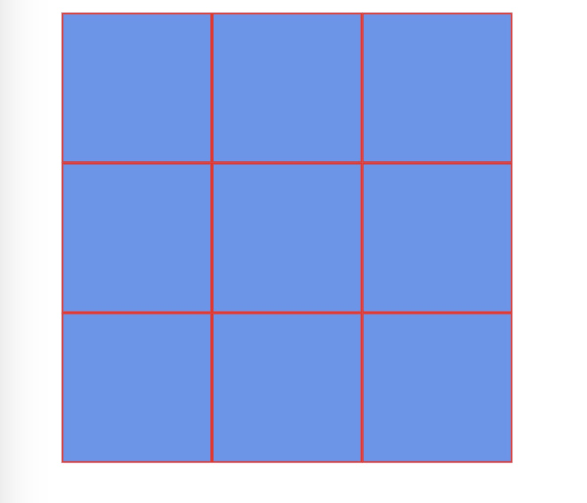
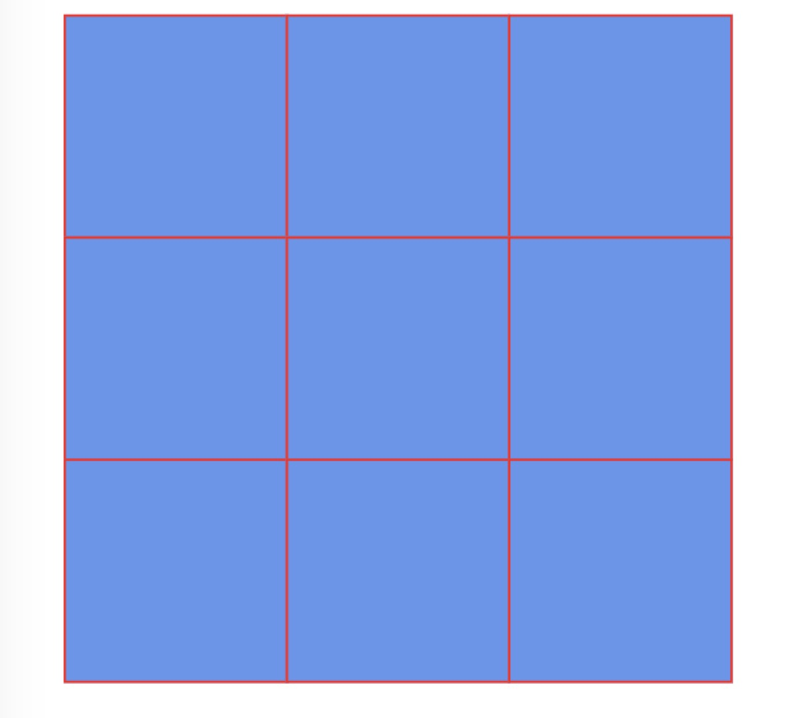

在项目中遇到需要创建九宫格的视图， 设计稿如下：


根据设计，要求九宫格的所有元素的边框都为 1px ，那么怎么做到呢？

首先我们按照如下写：

```html
 <style>
     ul {
         display: flex;
         flex-wrap: wrap;
         list-style: none;
     }
     ul li {
         width: 100px;
         height: 100px;
         background: cornflowerblue;
         border: 1px solid red;
     }
</style>
<ul>
    <li></li>
    <li></li>
    <li></li>
    <li></li>
    <li></li>
    <li></li>
    <li></li>
    <li></li>
    <li></li>
</ul>

```

按照上面的样式设计，可想而知，会出现下面这种情况：

可以发现，所有子元素的含有相邻元素的边框都变成了 2px ，这不符合设计。



解决方案：

对上面样式做简单修改

```css
ul li {
    width: 100px;
    height: 100px;
    background: cornflowerblue;
    border: 1px solid red;

    margin-left: -1px;
    margin-top: -1px;
}
```

通过将所有的列表子元素`向左` 和 `向上`偏移1px的位置，通过重叠的方式抵消掉因相邻而多出来的 1px 宽度，进而就完成了设计图中 九宫格所有边框相等的需求。




